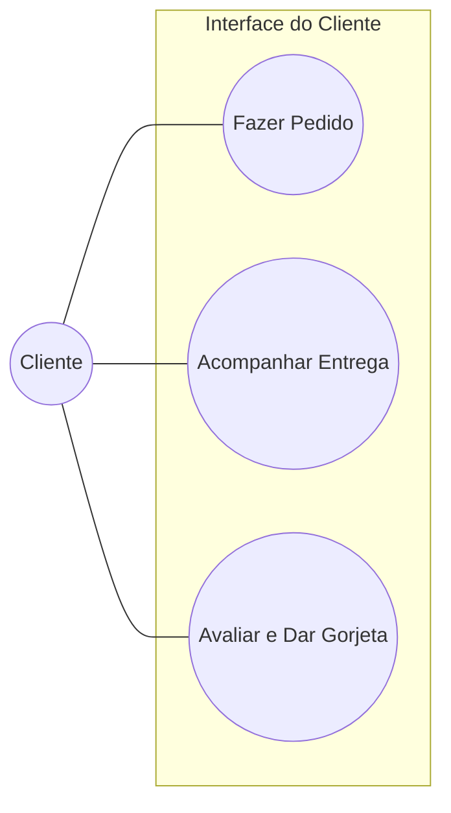

```mermaid
graph LR
    Cliente((Cliente))
    
    subgraph App_Cliente [Interface do Cliente]
        C1((Fazer Pedido))
        C2((Acompanhar Entrega))
        C3((Avaliar e Dar Gorjeta))
    end

    Cliente --- C1
    Cliente --- C2
    Cliente --- C3
```
