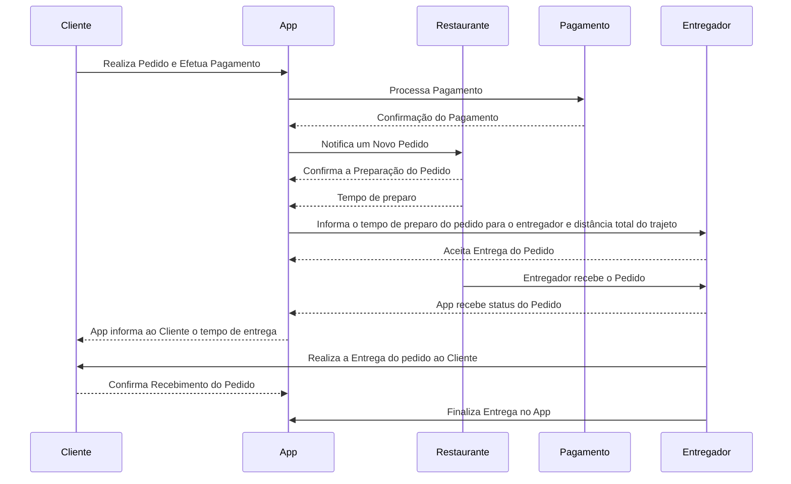
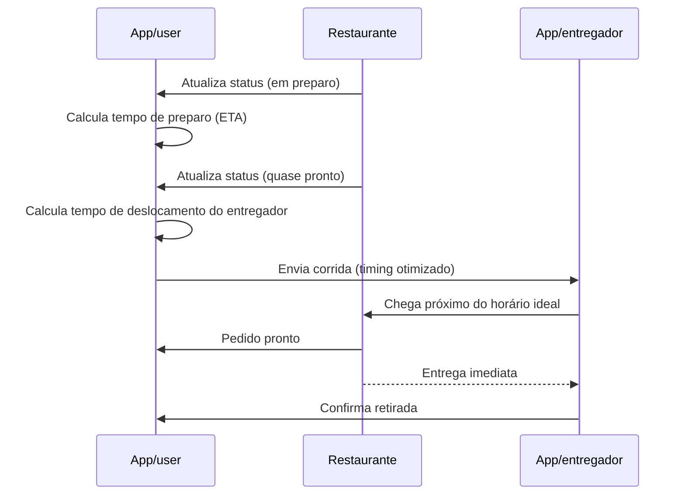
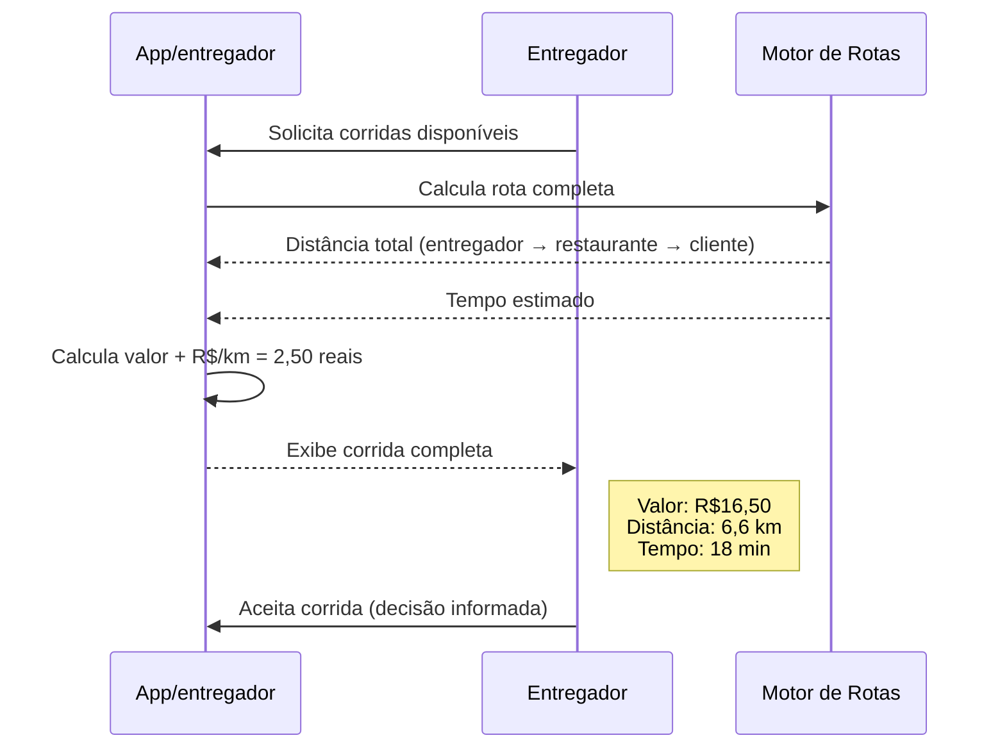
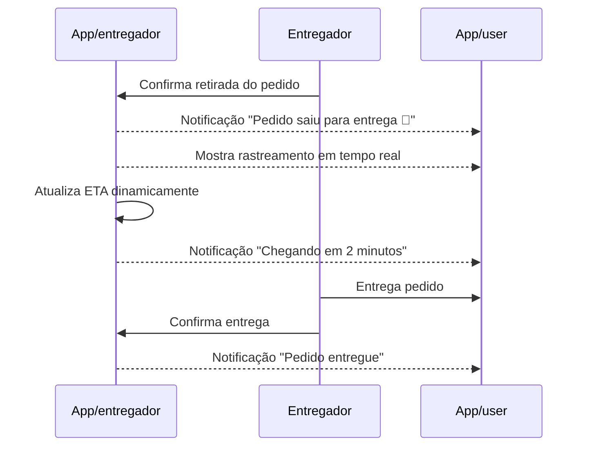

### **Diagrama de sequencia**

-Diagrama de sequência que demonstra de uma forma simples o funcionamento da plataforma.

##
### 1. Dispatch inteligente (sem espera no restaurante)

-Diagrama de sequência que demonstra de forma especifíca a parte do entregador na espera do pedido para continuar com a entrega.

##
### 2. Cálculo correto de distância e ganho
-Diagrama de sequência que demonstra para o entregador a distância total e o ganho total com a entrega.

##
### 3. Notificações automáticas ao cliente
-Diagrama de sequência que demonstra o funcionamento das notificações de preparo, o funcionamento de rastreio da entrega e tempo para entrega para o cliente.

