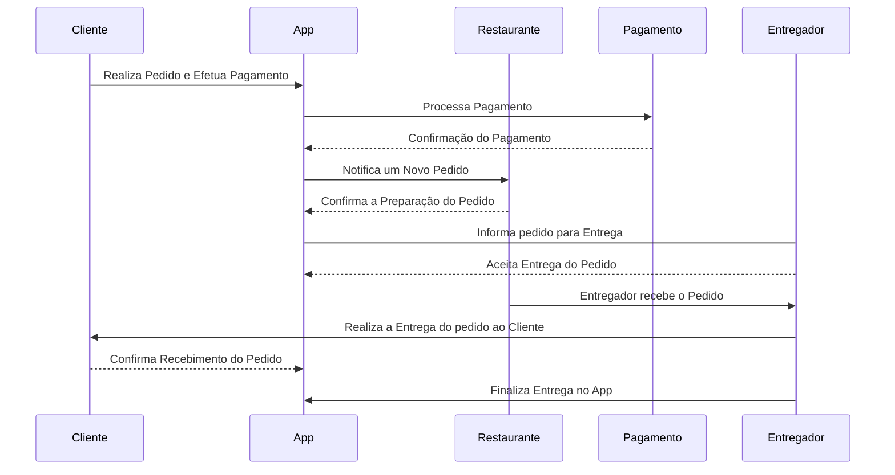

### **Diagrama de sequencia**

```mermaid
sequenceDiagram
    participant C as Cliente
    participant A as App
    participant R as Restaurante
    participant P as Pagamento
    participant E as Entregador

    
    C->>A: Realiza Pedido e Efetua Pagamento
    A->>P: Processa Pagamento 
    P-->>A: Confirmação do Pagamento
    A->>R: Notifica um Novo Pedido
    R-->>A: Confirma a Preparação do Pedido
    A->E: Informa pedido para Entrega 
    E-->>A: Aceita Entrega do Pedido
    R->>E: Entregador recebe o Pedido 
    E->>C: Realiza a Entrega do pedido ao Cliente
    C-->>A: Confirma Recebimento do Pedido
    E->>A: Finaliza Entrega no App
```
 
